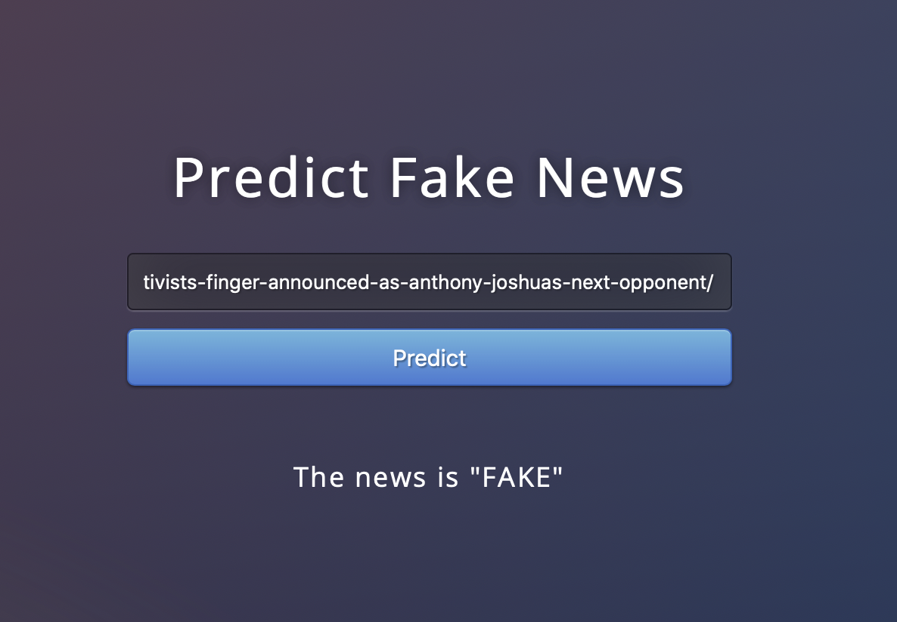

# Checkout the app on this [link](https://ravi-finds-fake-news.herokuapp.com)

# Introduction
Do you trust all the news you hear from social media? All news are not real, right? So how will you detect the fake news? We will be using Multinomial Naive Bayes method to classify the news article scrapped from the news article link, as fake or real.

# Data
The dataset we’ll use for this python project- we’ll call it news.csv. This dataset has a shape of 7796×4. The first column identifies the news, the second and third are the title and text, and the fourth column has labels denoting whether the news is REAL or FAKE. The dataset can be downloaded from [here](https://drive.google.com/file/d/1er9NJTLUA3qnRuyhfzuN0XUsoIC4a-_q/view)

# Project Structre
This project has four major parts :

* fake_news_detection.py - This contains code fot our Machine Learning model to classify the model 
* app.py - This contains Flask APIs that receives news url through GUI or API calls, extracts the article from the url, feeds it to the model and returns the prediction.
* templates - This folder contains the HTML template to allow user to enter url and displays whether the news is fake or real.
* static - This folder contains the CSS file.
* requirements.txt - It contains the list of libraries required to run the heroku app

# Running the project on local machine

Ensure that you are in the project home directory. Create the machine learning model by running below command -
python fake_news_detection.py
This would create a serialized version of our model into a file model.pkl

Run app.py using below command to start Flask API
python app.py
By default, flask will run on port 5000.

Navigate to URL http://127.0.0.1:5000 
